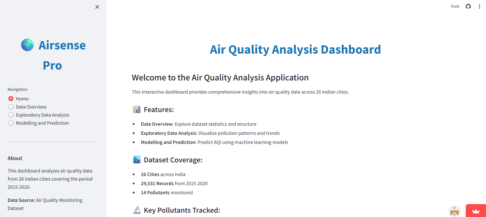
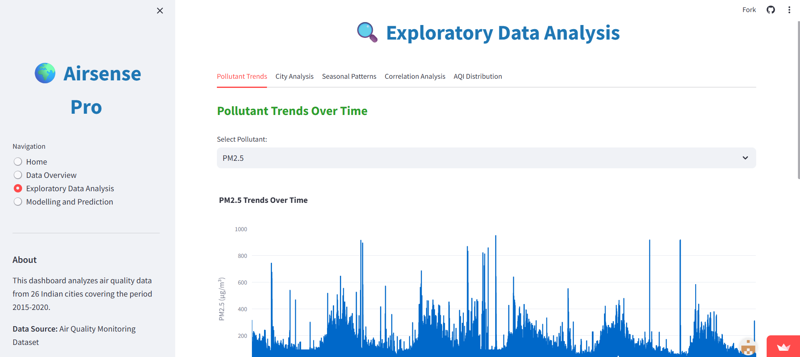
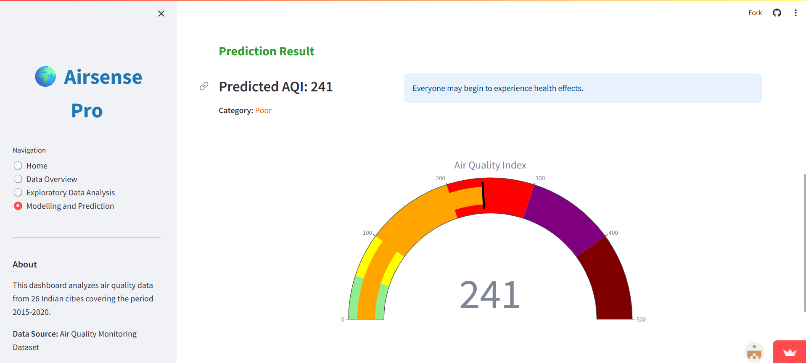

# 🌍 AirSense Pro - Air Quality Analysis & Prediction

[](https://www.python.org/)
[](https://streamlit.io/)

An interactive dashboard for analyzing and predicting Air Quality Index (AQI) across 26 Indian cities using machine learning.

## 📋 Table of Contents
- [Overview](#overview)
- [Features](#features)
- [Dataset](#dataset)
- [Installation](#installation)
- [Usage](#usage)
- [Model Performance](#model-performance)
- [Project Structure](#project-structure)
- [Technologies Used](#technologies-used)
- [Screenshots](#screenshots)
- [Contributing](#contributing)

## 🎯 Overview

AirSense Pro is a comprehensive air quality analysis system that provides insights into pollution patterns and enables AQI prediction using a Random Forest machine learning model. The project analyzes air quality data from 26 Indian cities spanning from 2015 to 2020, covering 29,531 records with 14 different pollutant measurements.

## ✨ Features

- **📊 Data Overview**: Explore dataset statistics, structure, and data quality
- **🔍 Exploratory Data Analysis**: 
  - Pollutant trends over time
  - City-wise pollution comparison
  - Seasonal pattern analysis
  - Correlation heatmaps
  - AQI distribution analysis
- **🤖 Machine Learning Model**:
  - Random Forest Regressor with hyperparameter tuning
  - R² Score: 0.91 (91% variance explained)
  - Mean Absolute Error: 19.25 units
- **🎯 AQI Prediction**: Interactive interface to predict AQI based on pollutant inputs
- **📈 Interactive Visualizations**: Built with Plotly, Seaborn, and Matplotlib

## 📊 Dataset

### Coverage
- **Cities**: 26 major Indian cities including Delhi, Mumbai, Bengaluru, Chennai, Kolkata, and more
- **Records**: 29,531 data points
- **Time Period**: 2015-2020
- **Features**: 16 original features, expanded to 24 after feature engineering

### Pollutants Monitored
- Particulate Matter (PM2.5, PM10)
- Nitrogen Compounds (NO, NO2, NOx, NH3)
- Carbon Monoxide (CO)
- Sulfur Dioxide (SO2)
- Ozone (O3)
- Volatile Organic Compounds (Benzene, Toluene, Xylene)

## 🚀 Installation

### Prerequisites
- Python 3.8 or higher
- pip package manager

### Setup

1. Clone the repository:
```bash
git clone https://github.com/yourusername/airsense-pro.git
cd airsense-pro
```

2. Create a virtual environment (recommended):
```bash
python -m venv venv
source venv/bin/activate  # On Windows: venv\Scripts\activate
```

3. Install required packages:
```bash
pip install -r requirements.txt
```

4. Ensure dataset files are in the `Datasets/` folder and model files are in the `Models/` folder.

## 💻 Usage

### Running the Streamlit Dashboard

```bash
streamlit run app.py
```

The application will open in your default web browser at `http://localhost:8501`

### Running the Analysis Notebook

Open and run the Jupyter notebook:
```bash
jupyter notebook air-quality-analysis.ipynb
```

## 📈 Model Performance

The Random Forest Regressor achieved excellent performance:

| Metric | Value |
|--------|-------|
| **R² Score** | 0.91 |
| **Mean Absolute Error (MAE)** | 19.25 |
| **Root Mean Squared Error (RMSE)** | 39.03 |
| **Mean Squared Error (MSE)** | 1523.40 |

### Best Hyperparameters
- `n_estimators`: 100
- `max_depth`: 20
- `max_features`: 'sqrt'
- `min_samples_split`: 2
- `min_samples_leaf`: 1

### Top Predictive Features
1. Total Pollution Index (0.69 correlation)
2. CO - Carbon Monoxide (0.68 correlation)
3. PM2.5 (0.62 correlation)
4. NO2 (0.53 correlation)
5. SO2 (0.49 correlation)

## 📁 Project Structure

```
airsense-pro/
│
├── Datasets/
│   ├── combined_air_quality_data.csv
│   ├── Ahmedabad_data.csv
│   ├── Delhi_data.csv
│   └── ... (other city datasets)
│
├── Models/
│   ├── aqi_prediction_model_compressed.pkl
│   ├── scaler.pkl
│   └── label_encoders.pkl
│
├── air-quality-analysis.ipynb
├── app.py
├── requirements.txt
├── README.md
```

## 🛠️ Technologies Used

### Data Analysis & Machine Learning
- **pandas**: Data manipulation and analysis
- **NumPy**: Numerical computing
- **scikit-learn**: Machine learning algorithms
- **joblib**: Model serialization

### Visualization
- **Matplotlib**: Static plots
- **Seaborn**: Statistical visualizations
- **Plotly**: Interactive charts

### Web Application
- **Streamlit**: Interactive dashboard framework
  [Airsense Pro](https://airsense-pro.streamlit.app/)

## 📸 Screenshots

### Home Page


### Exploratory Data Analysis


### AQI Prediction


## 🔄 Data Preprocessing

The project implements comprehensive preprocessing:
- **Missing Value Handling**: City-wise median imputation
- **Feature Engineering**: 
  - Temporal features (Year, Month, Season, Day of Week)
  - Pollution indices (PM_Ratio, NOx_Ratio, Total_Pollution_Index)
- **Encoding**: Label encoding for categorical variables
- **Scaling**: StandardScaler for numerical features

## 🤝 Contributing

Contributions are welcome! Please feel free to submit a Pull Request.

1. Fork the project
2. Create your feature branch (`git checkout -b feature/AmazingFeature`)
3. Commit your changes (`git commit -m 'Add some AmazingFeature'`)
4. Push to the branch (`git push origin feature/AmazingFeature`)
5. Open a Pull Request

## 👨‍💻 Author

**Your Name**
- GitHub: [@nidarshan98](https://github.com/nidarshan98)
- Project Link: [https://github.com/nidarshan98e/airsense-pro](https://github.com/nidarshan98/air-quality-prediction-system)

## 🙏 Acknowledgments

- Air Quality Monitoring Dataset providers
- Indian Central Pollution Control Board
- Open-source community for the amazing libraries

---

**⭐ If you find this project useful, please consider giving it a star!**
